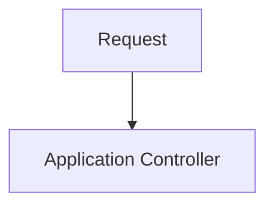

[](https://opensource.org/licenses/Apache-2.0)

# ya-flask-boilerplate
Yet another Python3 Flask 3 project boilerplate

# Assumptions
## Base Dependencies
Python 3
Flask >= 3.0.2

## Base Libraries
### Styling
Bootstrap 5.3
FontAwesome

### Code Quality / Testing / CI / Deploy
Behave for acceptance tests
Pytest for unit tests
Pylama for code audit
Fabric for deployment
Github CI for CI/CD
Python-dotenv to manage env variable
Celery for background job

## DB Options
json crud
SQLAlchemy: SqlLite | Postgre

## Authentication
OAuth with Google

# How to Works?

# Documentations

# Installation
## Quick Start

1. Clone the repo
  ```
  $ git clone https://github.com/MarceloFossRJ/flask-boilerplate.git
  $ cd flask-boilerplate
  ```

2. Initialize and activate a virtualenv:
  ```
  $ virtualenv --no-site-packages env
  $ source env/bin/activate
  ```

3. Install the dependencies:
  ```
  $ pip install -r requirements.txt
  ```

5. Run the development server:
  ```
  $ python app.py
  ```

6. Navigate to [http://localhost:5000](http://localhost:5000)

# Project Structure

  ```sh
  ├── Procfile
  ├── Procfile.dev
  ├── README.md
  ├── my_app.py
  ├── config.py
  ├── error.log
  ├── forms.py
  ├── models.py
  ├── requirements.txt
  ├── static
  │   ├── css
  │   │   ├── bootstrap-3.0.0.min.css
  │   │   ├── bootstrap-theme-3.0.0.css
  │   │   ├── bootstrap-theme-3.0.0.min.css
  │   │   ├── font-awesome-3.2.1.min.css
  │   │   ├── layout.forms.css
  │   │   ├── layout.main.css
  │   │   ├── main.css
  │   │   ├── main.quickfix.css
  │   │   └── main.responsive.css
  │   ├── font
  │   │   ├── FontAwesome.otf
  │   │   ├── fontawesome-webfont.eot
  │   │   ├── fontawesome-webfont.svg
  │   │   ├── fontawesome-webfont.ttf
  │   │   └── fontawesome-webfont.woff
  │   ├── ico
  │   │   ├── apple-touch-icon-114-precomposed.png
  │   │   ├── apple-touch-icon-144-precomposed.png
  │   │   ├── apple-touch-icon-57-precomposed.png
  │   │   ├── apple-touch-icon-72-precomposed.png
  │   │   └── favicon.png
  │   ├── img
  │   └── js
  │       ├── libs
  │       │   ├── bootstrap-3.0.0.min.js
  │       │   ├── jquery-1.10.2.min.js
  │       │   ├── modernizr-2.6.2.min.js
  │       │   └── respond-1.3.0.min.js
  │       ├── plugins.js
  │       └── script.js
  └── templates2
      ├── errors
      │   ├── 404.html
      │   └── 500.html
      ├── forms
      │   ├── forgot.html
      │   ├── login.html
      │   └── register.html
      ├── layouts
      │   ├── form.html
      │   └── main.html
      └── pages
          ├── placeholder.about.html
          └── placeholder.home.html
  ```


## Installation
